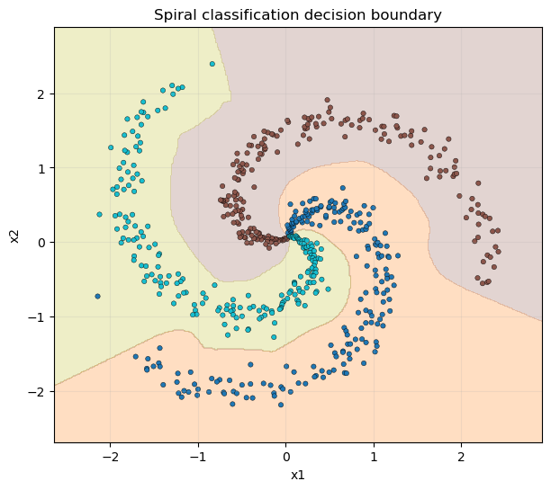

# MLP-FROM-SCRATCH


A fully from-scratch implementation of a Multi-Layer Perceptron (MLP) in Python using only NumPy.  
Includes forward/backward propagation, multiple activation functions, optimizers, loss functions, dropout, batch normalization, and visualization support.  
This project is designed for learning, experimenting, and extending neural network fundamentals without relying on high-level frameworks like TensorFlow or PyTorch.
Explore the Multilayer Perceptron demo live at: https://vhq-portfolio.streamlit.app/Multilayer_Perceptron 

---

# Introduction

This project provides an educational and transparent implementation of a Multi-Layer Perceptron (MLP) built entirely from scratch using NumPy.

**Target audience:**
- Students learning how neural networks work internally
- Developers experimenting with custom architectures
- Researchers prototyping lightweight models with no heavy dependencies

---

# Demo Screenshots

### 1. Spiral Classification  
  
A 2D spiral dataset correctly classified by the trained MLP.

### 2. MNIST Digit Recognition  
  
Sample predictions on the MNIST dataset after training.

### 3. Regression Task  
  
Fitting a non-linear function using the MLP regressor.

---

# Key Features

- **Layer Implementations:**
  - Fully-connected (`Linear`) layers
  - Activation layers: ReLU, Sigmoid, Tanh, Leaky ReLU, Softmax
  - Dropout layer for regularization
  - Batch Normalization (1D)

- **Loss Functions:**
  - Mean Squared Error (MSE)
  - Cross Entropy Loss (with optional Softmax)

- **Optimizers:**
  - SGD
  - Momentum
  - RMSProp
  - Adagrad
  - Adam

- **Training Utilities:**
  - Gradient clipping (L2 norm)
  - Mini-batch iterator with shuffle
  - Pickle-based model checkpoint (save/load model and optimizer)

- **Data Generation:**
  - Spiral, Circle, Line, Zone (2D/3D), and Polynomial regression

---

# System Requirements

- Python 3.8 or later  
- Required libraries:
  ```bash
  numpy>=1.21.0
  matplotlib>=3.4.0
  scikit-learn>=1.0.0
  tensorflow>=2.8.0  # (used only to load MNIST dataset)
  ```
---

# Installation & Usage

Clone the repository:

```bash
git clone https://github.com/honggquan24/MLP-from-scratch.git
cd MLP-FROM-SCRATCH
```

(Optional) Create a virtual environment:

```bash
python -m venv venv
source venv/bin/activate        # On Linux/macOS
venv\Scripts\activate           # On Windows
```

Install dependencies:

```bash
pip install -r requirements.txt
```

---

# Folder Structure

```
MLP-FROM-SCRATCH/
├── activations.py        # ReLU, Sigmoid, Tanh, LeakyReLU, Softmax
├── layers.py             # Linear, activation layers, Dropout, BatchNorm, SoftmaxLoss
├── loss.py               # MSE, CrossEntropy (functional)
├── network.py            # Neural network container class
├── optimizers.py         # SGD, Momentum, RMSProp, Adagrad, Adam
├── utils.py              # Gradient clipping, batching, model save/load
├── data_generator.py     # Spiral, Line, Circle, Zone, Zone_3D, Polynomial data
├── requirements.txt
└── notebook/
    └── images/           # Visualizations: spiral_result.png, mnist_predictions.png, etc.
```

# Configuration
No specific configuration files are used. The MLP’s hyperparameters (e.g., number of layers, neurons per layer, learning rate) are set directly within the Jupyter notebooks.

# License
This project is licensed under the MIT License - see the LICENSE file for details. (Note: No LICENSE file was detected in the repository’s contents.)

